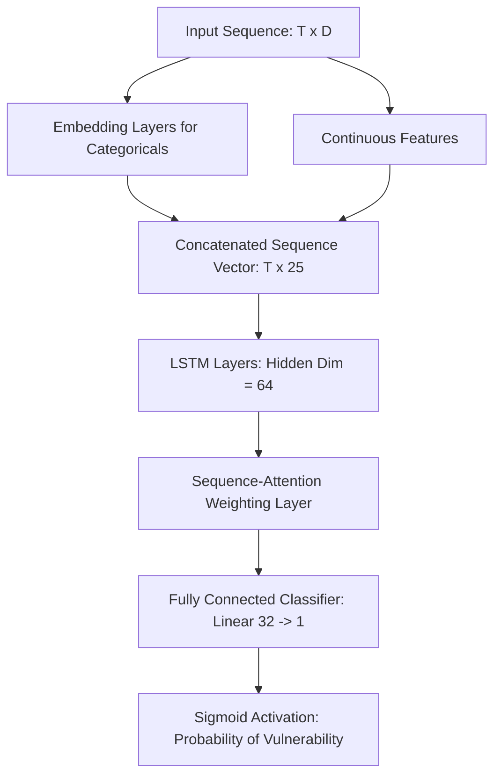

# Model Design Document: DeepSequence-T20I
**Member 1 Task: Sequence Constraints, Input Dimensions & Problem Parameters**

This document outlines the sequential modeling constraints, tensor input dimensions, and objective parameters for the DeepSequence-T20I batsman vulnerability engine.

---

## 1. Sequence Constraints

Cricket is a chronological sequence of discrete state transactions (deliveries). The sequential context faced by a batsman determines their current psychological pressure and technical exposure.

### A. Window Length ($T$)
*   **Rolling Window Range:** $6 \le T \le 12$ deliveries.
    *   *Rationale:* 6 deliveries represent 1 full over, which is the baseline block of tactical play. 12 deliveries (2 overs) represent the maximum sustained pressure window before tactical conditions generally shift (e.g., bowling change or match phase transition).
*   **Default Length:** $T = 6$ deliveries.

### B. Sequence Padding & Alignment
*   **Direction:** **Pre-padding**. Since the most recent delivery (the one immediately preceding the prediction target) carries the highest tactical weight, padding must be placed at the start of the sequence.
*   **Padding Value:** `0` (used for empty/non-existent deliveries when a batsman has faced fewer than $T$ balls in the match).
*   **Masking:** A binary attention mask sequence $M \in \{0, 1\}^T$ is fed to the LSTM to prevent padded elements from contributing to the hidden state calculations or attention weights.
    *   $M_t = 0$ if delivery $t$ is padded.
    *   $M_t = 1$ if delivery $t$ represents a real delivery.

### C. State Resets
*   The sequence history **does not cross match boundaries**.
*   The sequence history **does not cross innings boundaries**.
*   *Optional:* The sequence resets if a batsman goes off-strike for more than 18 deliveries (3 overs), as "rhythm" and "live pressure" decay over time. For the baseline model, we assume a continuous rolling window of balls faced by the specific batsman.

---

## 2. Input Dimensions & Feature Mapping

Each delivery in the sequence is mapped to a feature vector $x_t \in \mathbb{R}^D$, where $D$ is the total input dimension. We partition $x_t$ into categorical features (to be embedded) and continuous features.

### A. Categorical Features (Embeddings)

Using low-dimensional embeddings for categorical variables prevents sparse representation and improves LSTM generalization.

| Feature Name | Cardinality | Embedding Dim | Description / Key Mappings |
| :--- | :--- | :--- | :--- |
| **Match Phase** | 3 | 2 | Powerplay (0-6 overs), Middle (7-15), Death (16-20) |
| **Bowler Hand** | 2 | 2 | Left-arm, Right-arm |
| **Bowler Style** | 4 | 2 | Pace (Fast/Medium), Off-spin, Leg-spin, Chinaman |
| **Ball Line (NLP)** | 5 | 3 | Outside Off, Middle-Off, Middle, Middle-Leg, Down Leg |
| **Ball Length (NLP)**| 6 | 3 | Yorker, Full, Slot, Good Length, Short, Full Toss |
| **Shot Intent (NLP)**| 8 | 4 | Drive, Pull/Hook, Cut, Sweep, Flick/Glance, Block/Defend, Lofted, Leave |
| **Previous Wicket** | 2 | 2 | Binary: Whether a wicket fell on the previous delivery of the innings |

**Total Categorical Embedding Dimensions:** $2 + 2 + 2 + 3 + 3 + 4 + 2 = 18$ channels.

### B. Continuous Features (Numerical)

Numerical inputs are scaled to $[0, 1]$ or standardized to $\mu=0, \sigma=1$ to ensure stable gradient propagation.

| Feature Name | Input Dim | Scaling Method | Description |
| :--- | :--- | :--- | :--- |
| **Innings Progress** | 1 | Min-Max (0 to 120) | Current ball number of the innings |
| **Batsman Score** | 1 | Standardizer | Cumulative runs scored by the batsman in this match |
| **Batsman Balls** | 1 | Standardizer | Cumulative balls faced by the batsman in this match |
| **Runs from Last 6** | 1 | Min-Max (0 to 36) | Runs scored by the batsman in the previous 6 deliveries |
| **Dot Ball Streak** | 1 | Min-Max (0 to 12) | Number of consecutive dot balls faced by the batsman |
| **Bowler Speed Class**| 1 | Min-Max (0 to 1) | Approximate speed coefficient (0 = Slow Spin, 1 = Express Pace) |
| **Innings Run Rate** | 1 | Standardizer | Current run-rate of the batting team |

**Total Continuous Dimensions:** $7$.

**Total Input Dimension ($D$):** $18$ (Embeddings) $+ 7$ (Continuous) $= 25$ dimensions per delivery.

---

## 3. Raw Problem Parameters & Objective Function

### A. Prediction Target ($y_{T+1}$)
We formulate the predictor as a binary classification problem targeting the upcoming delivery $T+1$:
*   **$y_{T+1} = 1$:** The batsman is dismissed (out) or commits a fatal error (e.g., dropped catch, close LBW shout, or played-on).
*   **$y_{T+1} = 0$:** The batsman survives the delivery without a fatal error.

### B. Class Imbalance Handling
In T20I cricket, batsman dismissals represent a fraction of total deliveries faced (typically $4\% - 6\%$). Training a standard classification loss will cause the model to converge to the majority class ($y=0$).
To resolve this, we employ **Focal Loss** or **Weighted Cross-Entropy Loss**:

$$\mathcal{L}_{\text{focal}} = -\alpha (1 - p_t)^\gamma \log(p_t)$$

*   **$\alpha$ (Class Balance Coefficient):** Set to $0.90 - 0.95$ to penalize false negatives (missing a dismissal opportunity).
*   **$\gamma$ (Focus Parameter):** Set to $2.0$ to down-weight easy-to-classify survival deliveries and force the model to learn rare dismissal sequences.

### C. Neural Network Architecture Architecture

