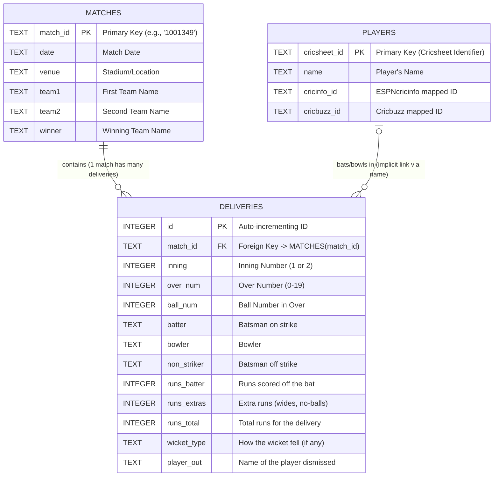

# DeepSequence-T20I Database Schema

This document outlines the Entity-Relationship (ER) model for the SQLite database powering the DeepSequence-T20I backend (`t20i_engine.db`).

## Tables Breakdown
- **MATCHES**: The root table tracking high-level match metadata.
- **DELIVERIES**: The core sequence table that stores ball-by-ball events. This is queried by the PyTorch LSTM to formulate ML input tensors.
- **PLAYERS**: The global dictionary registry populated from Cricsheet's `people.csv`. It cross-references with the `DELIVERIES` table to fetch live ESPNcricinfo profile URLs for the Streamlit dashboard.
